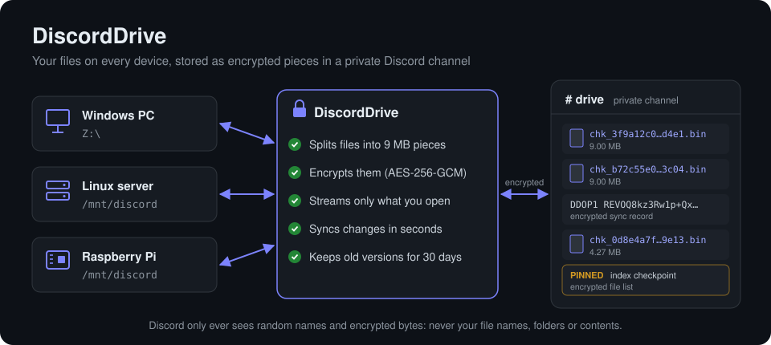
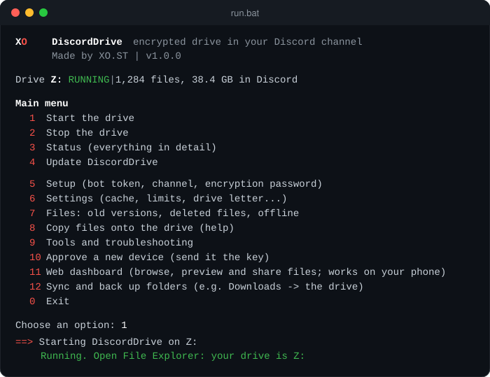
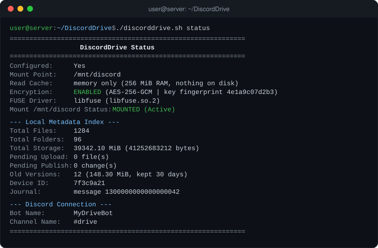
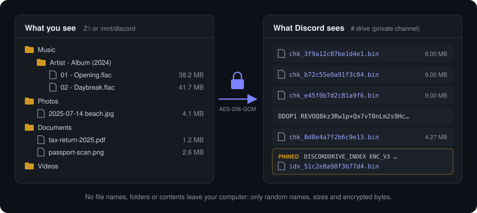

<h1 align="center">
    <br>
    DiscordDrive
</h1>
<p align="center"><b>An encrypted virtual drive backed by a private Discord channel.</b><br>Made by <b>XO.ST</b> · <a href="https://github.com/xo907/discord-drive">github.com/xo907/discord-drive</a></p>

---

DiscordDrive turns a private Discord channel into an encrypted drive: a drive letter on Windows
(e.g. `Z:\`) or a folder on Linux (e.g. `/mnt/discord`). It works on Windows, Linux servers and
Raspberry Pi, and keeps all your devices in sync.

Files you save to the drive are staged locally, split into pieces, compressed when that helps,
encrypted, and uploaded as attachments to your channel, together with a few **spare pieces** that
let the drive rebuild anything Discord loses. Reading only downloads the pieces that cover the
requested byte range, so videos stream and seek without downloading the whole file first.

It heals itself when Discord loses data, compresses and de-duplicates, keeps earlier versions and
snapshots, syncs and backs up folders, and comes with a web dashboard for your browser and phone:
files, a photo gallery, sharing and file requests, activity, storage insights, password-locked
folders and more. See [Web dashboard](#web-dashboard) and the [changelog](CHANGELOG.md).

<p align="center"></p>

> **Heads-up:** using Discord as general-purpose file storage may violate Discord's Terms of
> Service, and Discord can delete messages, attachments, or your bot/account at any time. Treat
> DiscordDrive as an experiment, **not** as your only copy of anything important.

---

## Quick start

About 10 minutes. You need a Discord account and a server you own (any empty server works:
in Discord, click **+** in the server list → **Create My Own**).

### Step 1: Create the Discord bot (same for Windows and Linux)

1. Go to <https://discord.com/developers/applications> → **New Application** → type any name → **Create**.
2. On the left click **Bot** → **Reset Token** → **Yes, do it!** → **Copy**.
   Paste the token somewhere for a minute; you need it in Step 2.
3. On the left click **OAuth2** and copy the **Client ID**. Paste it into this link in place of
   `YOUR_CLIENT_ID`, open the link, choose your server, and click **Authorize**:
   ```text
   https://discord.com/oauth2/authorize?client_id=YOUR_CLIENT_ID&scope=bot&permissions=109568
   ```
4. In your server, create a text channel for storage (for example `#drive`). Only you and the bot
   should be able to see it: in the channel's settings → **Permissions**, make it private and add your bot.
5. In Discord, go to **User Settings → Advanced** and turn on **Developer Mode**. Then right-click
   the channel → **Copy Channel ID**. You need this in Step 2 as well.

> **Prefer an installer?** Each [release](https://github.com/xo907/discord-drive/releases) has
> `DiscordDrive.exe` for Windows (no Python or git needed; WinFsp is still required) and a `.deb`
> for Debian, Ubuntu and Raspberry Pi OS (`sudo apt install ./discorddrive_*.deb`, then run
> `discorddrive`). The steps below install from source, which the menu can update by itself.

### Step 2a: Windows 10 / 11

Open a normal **PowerShell** (Start menu → type `PowerShell` → Enter; **not** "Run as administrator")
and paste:

```powershell
winget install -e --id Python.Python.3.12 --source winget --accept-package-agreements --accept-source-agreements; winget install -e --id WinFsp.WinFsp --source winget --accept-package-agreements --accept-source-agreements; winget install -e --id Git.Git --source winget --accept-package-agreements --accept-source-agreements
```

Click **Yes** if Windows asks for permission. "Found an existing package already installed" just means
you already have that program, which is fine. When it is done, **close PowerShell and open a new one**
(so it finds the programs you just installed), then paste:

```powershell
git clone https://github.com/xo907/discord-drive.git "$HOME\DiscordDrive"; cd "$HOME\DiscordDrive"; .\run.bat
```

The DiscordDrive menu opens. Choose **5 (Setup)** and answer the questions:

| Question | What to type |
|---|---|
| Discord Bot Token | the token from Step 1 |
| Private Discord Channel ID | the channel ID from Step 1 |
| Mount Point Drive Letter `[Z:]` | press **Enter** (or type another free letter) |
| Enable Zero-Knowledge Encryption? `[Y/n]` | press **Enter** |
| Encryption Password | a password you will remember. **Use the same one on all your computers.** |

When setup asks "Start the drive now?", press **Enter**. Open **File Explorer**: your new drive is
**Z:**. Anything you put there is stored in Discord.

From now on, just double-click **`run.bat`** in the `DiscordDrive` folder (your user folder) to get the menu.

### Step 2b: Linux (Debian, Ubuntu, Raspberry Pi OS)

Open a terminal and paste. It works both as a normal user with `sudo` and as `root`, installs what
DiscordDrive needs, and opens the menu:

```bash
S=$(command -v sudo); $S apt update && $S apt install -y git && git clone https://github.com/xo907/discord-drive.git ~/DiscordDrive && cd ~/DiscordDrive && bash discorddrive/scripts/linux/install.sh && ./run.sh
```

In the menu choose **5 (Setup)**. Paste the bot token and channel ID, type **`/mnt/discord`** as the
mount directory, press **Enter** at "Enable encryption?", and type an encryption password (the
**same one on all your computers**). Answer **Enter** to "Start the drive now?".

Your files are in **`/mnt/discord`**. From now on, run **`~/DiscordDrive/run.sh`** to get the menu.

### Everyday use

Everything is in the menu: **`run.bat`** on Windows (double-click it), **`./run.sh`** on Linux.

<p align="center"></p>

| Menu option | What it does |
|---|---|
| 1 / 2 | Start or stop the drive |
| 3 | Status: what is stored in Discord, what is uploading, cache and disk space |
| 4 | Update DiscordDrive to the latest version (stops and restarts the drive for you) |
| 5 | Setup: bot token, channel, encryption password |
| 6 | Settings: memory-only cache, cache size, disk-space limits, max file size, drive letter |
| 7 | Old versions, deleted files, offline files |
| 8 | How to copy lots of files onto the drive |
| 9 | Tools: check files, logs, encryption keys, rebuild the file list, Explorer menu, autostart |
| 10 | Approve a new device: send it the key when it asks |
| 11 | Web dashboard: browse, preview, upload and share files in your browser (also on your phone) |
| 12 | Sync and back up folders: keep e.g. your Downloads backed up to the drive by itself |

Every option is also a direct command, handy for scripts and remote servers:
`run.bat status`, `./run.sh start`, `./run.sh stop`, `./run.sh config max_file_size 2G`, and so on
(see [Usage](#usage)).

<p align="center"></p>

Stuck? See [Troubleshooting](#troubleshooting): it covers every problem we have run into on
Windows and Linux.

**Optional: keep nothing on this computer.** By default, files you open are cached on disk so they
open faster next time. To stream them from Discord every time instead (cached in RAM only), choose
**6 (Settings) → Read cache → `memory`** in the menu.

**Using a second computer?** Do Step 2 on it with the **same bot token and channel ID**. Setup
notices that the channel already holds your drive and offers to **request the key from one of your
other devices**:

1. On the new computer, setup shows a verification code (e.g. `4F7-2A1`) and waits.
2. On a computer that already has the drive, open the menu and choose **10 (Approve a new device)**.
   Check that it shows the same code, and accept.
3. The key is sent across, encrypted, and the new computer catches up with all your files and
   folders before it starts.

(You can also type your encryption password, or paste the key from `export-key`, instead.)

> **Back up your encryption password** (or the key that `export-key` shows; a copy of the config file
> is not a backup of it, see [The config file](#the-config-file)). Without it,
> the data in Discord cannot be decrypted. Nobody can recover it for you.

---

## What's new in 0.2

- **Self-healing.** Every group of 10 pieces is stored with 2 spare pieces (Reed-Solomon, the same
  idea as RAID 6), so any 2 lost pieces of a group can be rebuilt. If Discord deletes a piece, the
  file still opens: the piece is rebuilt on the fly, uploaded again, and every device learns where
  it now lives. A background check confirms every piece is still there (one full pass a week) and
  repairs what isn't, before losses can pile up. Files uploaded with older versions get spare
  pieces added in the background. Everything stays 100% on Discord: spare pieces are ordinary
  encrypted attachments in your channel. They cost about 20% extra space on big files.
- **Compression and de-duplication.** Pieces that shrink (documents, text, logs, many app files)
  are compressed before they are encrypted; lossless, and the encryption is exactly as strong.
  Pieces the drive already stores (a copied file, the same photo in two folders) are not uploaded
  again.
- **Faster uploads.** Several pieces upload at once, and you can add extra bots: Discord limits
  how fast *one* bot may post, so each extra bot adds speed (menu 6 → Bots, or `bots add`).
- **Web dashboard.** Browse, preview (photos, video, music, PDF, text), upload, rename, share and
  restore files in your browser, see what is uploading and how healthy the drive is. Turn on
  "Web dashboard on your network" to use it from your phone. See [Web dashboard](#web-dashboard).
- **Snapshots.** The whole drive as it was at one moment, taken every 24 hours and kept 14 days.
  Bring back a folder (or everything) as it was on Tuesday, into a new folder so nothing current
  is touched.
- **Selective sync.** Folders marked "available offline" now stay downloaded as they change,
  including new files added on other devices. Folders can be hidden on one device only (`hide`),
  e.g. `/Movies` on the Raspberry Pi.
- **Stronger password protection** for new drives: passwords are turned into keys with scrypt,
  which makes guessing them far more expensive than before (existing drives keep working).
- **Tests** run on Windows and Linux for every change, and releases come with installers.

> **Update every device.** Pieces uploaded by 0.2 can be compressed, which older versions can't
> read. Update all your devices (menu option 4) before copying new files onto the drive.

## Features

<p align="center"></p>

- **Client-side encryption (AES-256-GCM).** Chunks and index backups are encrypted before upload.
  Attachments get random names (`chk_<random>.bin`) and empty message text, so Discord never sees
  file names, folder structure, or contents. It can still see how many chunks there are, their
  sizes, and when they were uploaded.
- **Self-healing.** Spare pieces rebuild what Discord loses; a background check finds losses early.
- **Compression and de-duplication** before encryption; extra bots and parallel uploads for speed.
- **Web dashboard** for your browser and phone (installable as an app): a home page, a photo and video
  gallery, bookmarks with link previews, starred and recent files, an activity list, storage insights,
  in-browser text editing, and Ctrl+K to find anything.
- **Sharing both ways**: expiring, password-protected links to give files out, and **file requests**
  that let others send files into a folder without seeing it.
- **Save from a link**: the drive downloads a web address straight into a folder.
- **Other apps (WebDAV)**: open the drive from phone file managers, "Map network drive", Finder, rclone.
- **Snapshots** of the whole drive, restorable folder by folder.
- **Password-locked folders**: gone from the drive letter and the dashboard until unlocked
  ([more](#password-locked-folders)).
- **Sync and back up folders** on your computer: backup, mirror, two-way sync, move, or a local copy
  of a drive folder; live, every N minutes, daily or by hand ([more](#sync-and-back-up-folders)).
- **Real drive / mount.** Uses [WinFsp](https://winfsp.dev/) on Windows and libfuse on Linux,
  so any application can use it.
- **Streaming and seeking.** Byte-range reads, read-ahead, and an on-disk LRU chunk cache.
- **Files on demand.** After upload the local copy is removed. Files take no local space until opened.
  With the memory-only cache, opened files are not stored on disk either (see below).
- **Offline pinning.** Keep chosen files or folders cached locally (on Windows, also from the
  Explorer right-click menu).
- **Live sync between devices.** Changes made on one computer appear on the others within a few
  seconds. Edits made on two devices at the same time are merged without losing either one.
- **File versions and undelete.** Replaced and deleted files are kept for 30 days (configurable).
  You can list them, bring back an older version, or recover a deleted file.
- **Crash-safe.** A local SQLite (WAL) index. Unfinished uploads resume on the next start, and
  changes made while offline are sent when the connection comes back.
- **Disaster recovery.** Encrypted index checkpoints are pinned in the channel. A fresh install
  restores the whole folder tree automatically.
- **Back-pressure.** Large copies pause while the upload backlog exceeds `staging_max_bytes` or
  free disk space drops below `min_free_disk_bytes`, so a big `rsync` cannot fill your local disk.

## Requirements

| | Windows 10/11 | Linux (Debian, Ubuntu, Raspberry Pi OS, ...) |
|---|---|---|
| Python | 3.9+ | 3.9+ |
| Filesystem driver | [WinFsp](https://winfsp.dev/rel/) | `libfuse2` (`libfuse2t64` on Debian 13+) + `fuse` |
| Encryption | built in (Windows CNG) | `python3-cryptography` |
| HTTP | `curl` (ships with Windows) | `curl` (or Python's urllib fallback) |

There are no other dependencies. A copy of [fusepy](https://github.com/fusepy/fusepy) is
vendored in `discorddrive/_vendor/` (ISC license).

---

## Configuration

The bot only needs *View Channels, Send Messages, Attach Files, Read Message History* and
*Manage Messages* (plus *Pin Messages* where Discord lists it separately); that is what
`permissions=109568` in the invite link grants. No privileged gateway intents are needed.

The config is stored outside the repository:

| | Config (token + key) | Data (index, cache, staging, log) |
|---|---|---|
| Windows | `%APPDATA%\DiscordDrive\config.json` | `%LOCALAPPDATA%\DiscordDrive\` |
| Linux | `~/.config/DiscordDrive/config.json` (mode 600) | `~/.local/share/DiscordDrive/` |

Change settings in the menu (**6 Settings**), with `config <name> <value>` (run `config` alone to
list them), or by editing the file.
Sizes accept units, e.g. `config max_file_size 2G` or `config min_free_disk_bytes 4G`.

Useful limits:

| Setting | Default | What it does |
|---|---|---|
| `max_file_size` | `0` (no limit) | Refuse files larger than this ("File too large"), so one huge file can't tie up the disk and uploads for hours |
| `min_free_disk_bytes` | `2G` | Never take the local disk below this much free space |
| `staging_max_bytes` | `10G` | Pause writing while this much is waiting to upload |
| `cache_mode` | `disk` | `memory` keeps files you open in RAM only |
| `parity_enabled` | `true` | Spare pieces (self-healing). `parity_group` (10) data pieces get `parity_pieces` (2) spare pieces |
| `scrub_days` | `7` | One full check that every piece is still on Discord takes this long (`scrub_enabled` turns it off) |
| `protect_existing` | `true` | Add spare pieces to files uploaded before self-healing (downloads each such file once) |
| `compression` / `dedup` | `true` | Compress pieces that shrink; store identical pieces once |
| `snapshot_interval_hours` | `24` | Automatic snapshot of the whole drive (`0` = off), kept `snapshot_keep_days` (14) |
| `web_enabled` / `web_port` | `true` / `8765` | The web dashboard on `http://127.0.0.1:8765` |
| `web_lan` | `false` | Also open the dashboard to phones and computers on your home network |

`DISCORDDRIVE_CONFIG`, `DISCORDDRIVE_TOKEN` and `DISCORDDRIVE_CHANNEL` environment variables
override the config file location, token, and channel. See [`docs/config.example.json`](docs/config.example.json)
for every option.


---

## Usage

The menu (`run.bat` / `./run.sh` with nothing after it) covers everything. The same actions are
available as commands: put them after `run.bat` on Windows or `./run.sh` on Linux, e.g.
`run.bat status` or `./run.sh stop`.

```text
start                                Start the drive in the background
stop                                 Stop the drive (uploads continue on the next start)
status                               What is stored, what is uploading, cache and disk space
mount                                Run the drive in this window (Ctrl+C to stop)
setup                                Bot token, channel, encryption password
config [<name> [<value>]]            Show or change a setting (sizes like 500M, 2G)
offline <path>                       Keep a file/folder on this computer for offline use
free-space [<path>] [--all]          Remove cached data (one path, or everything)
clear-cache                          Remove all cached data that isn't kept offline
versions <file>                      List the older versions kept for a file
restore-version <file> <n> [--as p]  Bring back version n (or save it as a new file p)
deleted [<folder>]                   List deleted files that can still be recovered
undelete <path>                      Recover a deleted file
purge <path> [--all]                 Delete a deleted file (or everything deleted under a folder) for good
verify [<path>]                      Check that files can be downloaded and decrypted
log [-n 30] [--errors]               Show the end of the log file
approve-keys                         Send the key to a new device that asked for it
request-key                          Ask one of your other devices for the key
export-key                           Show the encryption key, to copy it to another device
add-old-key [--from-config <file>]   Add an earlier key so files encrypted with it stay readable
restore                              Rebuild this device's file list from Discord (drive stopped)
backup                               Save an index checkpoint now (normally automatic)
context-menu install|uninstall       "Make available offline" / "Free up space" in Explorer (Windows)
web [--open]                         Show (and open) the address of the web dashboard
web-password                         Set the dashboard's user name and password
health [--check] [--protect]         Self-healing status; check every piece now; protect old files now
snapshots [create [label]|delete <n>] List snapshots, take one now, or delete one
snapshot-restore <n> [path] [--to p] [--in-place]
                                     Bring back a folder (or everything) from snapshot n
bots [add [token]|remove <n>]        Extra bots for faster uploads
hide <folder> / unhide <folder>      Don't show a folder on this device (it stays everywhere else)
lock <path> / unprotect <path>       Lock a folder or file with a password (hidden everywhere) / remove the lock
unlock [--minutes N] / relock        Show locked folders on this device's drive for a while / hide them again
sync [list|add|edit|remove|run|stop|pause|resume|status|modes]
                                     Folders kept in sync with the drive (see "Sync and back up folders")
```

Paths can be given as `Z:\Folder\file.mp4`, `/mnt/discord/Folder/file.mp4`, or `/Folder/file.mp4`.

### Project layout

```text
run.bat / run.sh       start here: the menu, or a command
discorddrive/          the program (Python)
  scripts/windows/     helpers used by run.bat (hidden start, Explorer menu)
  scripts/linux/       install.sh (requirements) and the systemd service
  web/                 the web dashboard (plain HTML, CSS and JavaScript)
docs/                  images and config.example.json
tests/                 tests (python -m unittest discover -s tests), run for every change on GitHub
packaging/             builds DiscordDrive.exe and the .deb (see .github/workflows/release.yml)
```

### Start automatically on Linux (systemd)

The menu shows the exact commands under **9 (Tools) → "How to start the drive automatically at
boot"**. In short:

```bash
mkdir -p ~/.config/systemd/user
sed "s|%h/DiscordDrive|$HOME/DiscordDrive|g" ~/DiscordDrive/discorddrive/scripts/linux/discorddrive.service > ~/.config/systemd/user/discorddrive.service
systemctl --user daemon-reload && systemctl --user enable --now discorddrive
sudo loginctl enable-linger "$USER"                 # keep running when you are logged out
```

### Sharing over Samba / with other users (Linux)

Set `"allow_other": true` in the config, or pass `mount --allow-other`. This requires
`user_allow_other` in `/etc/fuse.conf`, which the Linux installer (`install.sh`) enables.

---

## Self-healing

Discord can delete messages or attachments at any time. DiscordDrive plans for that:

- **Spare pieces.** Each group of `parity_group` (10) pieces of a file gets `parity_pieces` (2)
  spare pieces, computed with Reed-Solomon coding. Any 2 pieces of a group can go missing and the
  group can still be rebuilt exactly (every piece has a SHA-256 checksum, so a rebuilt piece is
  verified). Small files (fewer than 4 pieces) get one spare piece. Spare pieces are encrypted and
  named like every other piece, so Discord can't tell them apart.
- **On the fly.** When a piece is missing while you read a file, it is rebuilt from the rest of
  its group and the read simply succeeds. The rebuilt piece is uploaded again, and every device
  is told where it lives now.
- **Background check.** One device (the one with the smallest device ID among those active in
  the last 3 days) asks Discord about every piece, spread over `scrub_days` (a week), and repairs
  anything missing, including lost spare pieces. `health` shows the progress; `health --check`
  checks everything right now.
- **Older files.** Files uploaded before 0.2 have no spare pieces yet. That same device adds them
  in the background, one file at a time, while nothing else is uploading (it downloads each file
  once). `health --protect` does it all now; `config protect_existing false` turns it off.

Space: about 20% extra for big files, one extra piece for small ones. `config parity_pieces 3`
survives 3 losses per group; `config parity_enabled false` turns spare pieces off for new uploads.

## Web dashboard

The drive serves a small web app on `http://127.0.0.1:8765` while it runs: menu **11**, or
`run.bat web --open` / `./run.sh web --open`. It shows your files (search, preview, download,
upload by drag and drop, new folder, rename, delete, earlier versions, "available offline"),
recently deleted files, snapshots, and a health page (protection, checks, repairs, uploads,
devices).

- **Signing in.** The dashboard asks for a user name and password. Create them the first time you
  open it on the computer running the drive, or with menu 11 / `web-password` (the way to do it on a
  Raspberry Pi). Only a scrypt hash of the password is stored. After 5 wrong passwords an address
  has to wait before trying again. Changing the password signs every browser out; the account
  button (top right) signs this one out.
- **Right-click** (or **long-press** on a phone) any file or folder for the usual actions: preview,
  download (folders as a ZIP), copy a share link, available offline, rename, move, duplicate,
  earlier versions, details, delete. Right-click empty space for new folder and uploads (files or a
  whole folder).
- **Drag and drop** files and folders onto a folder, a part of the path at the top, or "Files" to
  move them, onto "Deleted" to delete them. Ctrl/Cmd-click and Shift-click select several. Files
  dragged in from your computer upload into the folder you drop them on.
- **Notes**: a notes tab. Notes are files in `/Notes` on the drive (encrypted, synced, with earlier
  versions). Typing saves to this computer at once and uploads to Discord when you pause; **Save**
  (Ctrl+S) uploads right away. A note changed on another device updates by itself.
- **Contacts**: an encrypted address book (one vCard file, `/Contacts/Contacts.vcf`, synced and
  versioned). Import vCard (.vcf) or Google / Outlook CSV exports from your phone, iCloud, Google
  or Outlook; create and edit contacts; export them again as .vcf.
- **Gallery**: every photo and video on the drive (or in one folder), newest first, with thumbnails and
  a full-screen viewer. Files can also be shown as a grid with thumbnails. The browser makes a
  thumbnail the first time a picture is shown (or all at once with **Create all thumbnails**, which
  reads each photo once from Discord), and the drive keeps them in `<data dir>/thumbs`, encrypted with
  your key. Formats your browser can't show (e.g. HEIC outside Safari, MKV) keep their icon.
- **Home, Starred, Recent, Activity**: the dashboard opens on an overview. Star files and folders
  (synced to every device); Activity lists what was added, changed, moved and deleted, and on which
  device.
- **Bookmarks**: paste a link and it is saved as a card with the page's title, description, icon and
  banner picture (the same tags link previews use). Tags, notes, a filter, pinned favourites at the top,
  and Ctrl+V anywhere on the page. Kept in `/Bookmarks` on the drive with their pictures: encrypted, synced, versioned, and
  nothing is loaded from the sites when you look at them.
- **Storage**: space by kind, the biggest folders and files, and identical files (keep the oldest and
  delete the copies in one click). Folders show their size in Files.
- **File requests**: right-click a folder → **Request files…**. Whoever has the link can send files into
  it from a simple page, cannot see what is in the folder, and never overwrites anything. Choose how
  long it works, an optional password and the largest file. Shared lists it with the files received.
- **Edit text files** (notes, code, config) in the browser: **Edit**, Ctrl+S saves, the version before
  is kept.
- **Save from a link**: paste a web address and the drive fetches the file itself into the open folder
  (nothing passes through your browser or phone). Only addresses on the internet are fetched.
- **Find anything**: Ctrl+K searches files, pages and actions. Paste a screenshot or copied files
  anywhere to upload them; select several items and **Download** gives one ZIP.
- **Install as an app**: "Add to Home Screen" on a phone, or the install button in the browser's address
  bar, gives the dashboard its own icon and window.
- **Other apps (WebDAV)**: turn on Settings → **Other apps (WebDAV)** and connect file managers, "Map
  network drive" (Windows), "Connect to Server" (Finder), rclone or backup apps to
  `https://your-address/dav/` with the dashboard's user name and password. Use your https address:
  over plain http the password is sent unencrypted and Windows refuses to connect. Password-locked
  folders are never shown over WebDAV.
- **Sync**: folders on the computer running the drive kept in step with folders on the drive (backup,
  mirror, two-way, move, download), with live progress, Sync now, pause and recent runs. See
  [Sync and back up folders](#sync-and-back-up-folders).
- **Sharing**: choose how long a link works (1 hour to never), an optional password, and whether
  people may download or only view. The page shows photos, video, music, PDFs and text, and whole
  folders can be shared. The **Shared** tab lists your links, their views, and turns them off.
  Each shared file also has a **direct link** (`…/s/<id>/<file name>`): posted on its own in Discord,
  the image, GIF, video or song is shown without the link (needs the dashboard reachable from the
  internet, e.g. through your reverse proxy, and no password on the link).
- **Behind a reverse proxy** (e.g. Nginx Proxy Manager): add your domain under Settings → Domain
  names (or `config web_hosts drive.example.com`); share links then use that domain. Settings is in
  the account menu (top right) and in the DiscordDrive menu.
- **Deleted** files can be selected (or all at once) and restored, or deleted forever, which
  removes them from Discord on every device straight away (`purge <path>` on the command line).
- **Phone.** `config web_lan true` (menu 6 → Web dashboard on your network), restart the drive,
  then open the "On your phone" link from `web` on a phone on the same Wi-Fi. The connection
  inside your home network is not encrypted (plain HTTP), so only do this on a network you trust.
- **Share links** give one file to someone else for 7 days. They work for whoever can reach this
  computer: on your home network with `web_lan`, or from anywhere only if you forward the port
  yourself (not recommended).

## Faster uploads with more bots

Discord limits how fast each bot may post messages. Uploads already send several pieces at once,
and every extra bot adds the same again:

1. Create another application and bot exactly as in [Step 1](#step-1-create-the-discord-bot-same-for-windows-and-linux)
   and invite it to the same server, with access to the drive channel.
2. Menu **6 (Settings) → Bots for uploading → Add a bot**, or `bots add` (it asks for the token,
   checks the bot can post in the channel, and saves it). Restart the drive.

Each device can use its own set of extra bots; any bot in the channel can read every piece.

## The config file

The config file (`%APPDATA%\DiscordDrive\config.json`, or `~/.config/DiscordDrive/config.json`) holds
your settings and the secrets the drive needs: bot tokens, encryption keys, the dashboard sign-in. The
secrets are not stored readable. They sit in one entry, `protected`, encrypted for the computer and
account they belong to:

- **Windows**: with the account's own protection (DPAPI). Only your Windows account on that computer
  can decrypt them.
- **Linux / Raspberry Pi**: with a key made from a key file kept apart from the config
  (`~/.local/share/DiscordDrive/machine.key`, readable by you only), the machine's id and your user id.

So a copy of the file, in a backup, a synced folder, a screenshot or a message asking for help, gives
nothing away. It is automatic: nothing to type, the drive still starts by itself, and a config from an
earlier version is converted the first time the drive starts. Settings stay readable and editable; a
token or key you type into the file by hand is picked up and encrypted at the next start.

- **Keep your encryption password or key elsewhere.** A copy of the config is no longer a copy of the
  key: after reinstalling Windows, resetting the account's password from outside, or moving to a new
  machine, the secrets can't be read and `setup` asks for the bot token and your encryption password
  again (or the key from `export-key`, or let another of your devices send it).
- **What it doesn't do**: a program running as you on that computer can ask for the secrets the same
  way DiscordDrive does, and while the drive runs the key is in memory. It protects the file, not a
  computer someone else already controls.
- `config` shows how the secrets are kept; `config protect_config false` stores them readable again.

## Password-locked folders

Lock a folder or a file with a password and it is gone, with everything in it, until the password is
typed: from the drive letter / mount folder and from the dashboard (files, search, gallery, deleted
files, snapshots, shared links, the log), on all your devices. Not even its name is shown.

- **Lock**: in the dashboard right-click the folder or file → **Lock with a password…**; or
  `lock <path>` (menu 7). Locks sync to your other devices like everything else.
- **Unlock** by typing a password; everything locked with that password opens, so nothing has to list
  what is locked. In the dashboard: the padlock at the top → **Unlock…**, which opens it in that browser
  only (turn on "Also show on the drive" to see it on that computer's drive letter too). In the
  terminal: `unlock` shows it on this device's drive (`--minutes 60`, or `--minutes 0` for until the
  drive stops).
- **It locks again by itself** after `lock_timeout_minutes` (15) without use, when you sign out, with
  **Lock again now** / `relock`, and whenever the drive restarts.
- **Remove a lock** with its password: right-click → **Remove the lock…**, or `unprotect <path>`. If
  you forgot it, `unprotect <path> --forgot` asks for the dashboard's password instead.
- Wrong passwords are slowed down like wrong sign-ins. Folder sync keeps copying into a locked folder,
  and a link you shared to a locked item itself keeps working (locked things *inside* a shared folder
  don't show).

What it is and isn't: a lock is a gate, not a second layer of encryption. Locked files are encrypted
with the drive's key like all others. It keeps out anyone using your computer, the drive letter or the
dashboard; it does not stop someone with technical skill who can run programs as you on that computer. While a
folder is unlocked on the drive letter, every program on that computer can read it, and Windows may
remember file names it saw (recent files, Explorer's thumbnail cache). The log *file* on disk and the
terminal commands (`deleted`, `versions`) still name locked files; the dashboard's Log tab does not.

## Sync and back up folders

Keep a folder on this computer in step with a folder on the drive, e.g. `C:\Users\you\Downloads`
backed up to `Z:\Downloads` by itself. Set it up in the dashboard (**Sync → Add a folder**, with a
folder browser for both sides), in the menu (**12**), or with the `sync` command:

```powershell
run.bat sync add C:\Users\you\Downloads Z:\Downloads --mode backup
```
```bash
./run.sh sync add ~/Pictures /Photos --mode two-way --every 30
```

**What it does** (`--mode`):

| Mode | Direction | What happens |
|---|---|---|
| `backup` (default) | computer → drive | New and changed files are copied, each one once. Files you delete here stay on the drive, and copies you move, rename or delete on the drive are not put back. |
| `mirror` | computer → drive | The drive folder becomes an exact copy: deleting here deletes there too (it stays under **Deleted**, so it can be brought back). |
| `two-way` | both ways | Changes and deletions on either side are copied to the other. A file changed on both sides since the last sync is kept twice (`name (conflict <computer> <date>).ext`). |
| `move` | computer → drive | Files are copied, then deleted here once they are safely stored in Discord. Frees space, e.g. for Downloads. |
| `download` | drive → computer | A local copy of a drive folder (e.g. on an external disk). Nothing is deleted here. |
| `download-mirror` | drive → computer | An exact local copy. Files deleted on the drive are moved to a holding folder (`<data dir>\sync\trash`, kept 30 days), never deleted outright. |

**When it runs** (`--when`): `live` (default: a few seconds after something changes; Windows tells
the drive at once, elsewhere and for changes on the drive it checks every few seconds),
`interval` (`--every 30` minutes), `daily` (`--at 03:00`) or `manual` (only `sync run` or **Sync now**).

- A backup remembers what it has copied: reorganise the copies on the drive as you like, and only a
  file that changes on the computer is copied again. `sync run <n> --again` (dashboard: **Copy
  everything again**) puts back whatever is missing in the drive folder. Use `mirror` if the drive
  folder should always match the computer exactly.
- Copies keep each file's modification time, so a file is copied once, not on every pass. A file that
  is still being written (changed in the last 5 seconds, or locked by the program writing it) waits for
  the next pass; unfinished downloads (`*.crdownload`, `*.part`, ...) and temporary files are never
  copied. Skip more with `--exclude "*.iso,Temp/"`.
- Safety: a folder that isn't there (a disk that isn't connected) changes nothing, and if one side is
  suddenly empty, nothing is deleted on the other. Mirror and two-way sync need a folder on the
  drive, not the whole drive.
- `sync list`, `sync status <n>` (result, problems, recent runs), `sync run <n>` (shows progress),
  `sync stop <n>`, `sync pause <n>` / `resume`, `sync edit <n> --mode ... --when ...`, `sync remove <n>`
  (nothing is deleted), `sync modes`.
- Syncing runs inside the drive, so the drive has to be running. The folders belong to the device they
  are on (they are kept in its config file); what they copy onto the drive appears on all your devices.
- For safety, folders on a computer can only be chosen or changed in the dashboard **on that computer
  itself**, because that means reading and writing files outside the drive. Syncing now and pausing
  work from everywhere. To allow it from other devices too, turn on "Let other devices choose folders
  here" at the bottom of Sync (on that computer), or `config sync_remote_edit true`.

## Snapshots

Every `snapshot_interval_hours` (24) one device takes a snapshot: a record of the whole drive at
that moment. Its pieces are kept until it expires after `snapshot_keep_days` (14), even if the files
are changed or deleted meanwhile. Snapshots cost no space until files change.

- `snapshots` lists them, `snapshots create` takes one now (menu 7 → Snapshots).
- `snapshot-restore 2 /Photos` brings `/Photos` back as it was in snapshot 2, into a new folder
  `Restored <date>`, so nothing you have now changes. `--in-place` puts files back where they were
  instead (their current content is kept as an earlier version, so that can be undone too).
- The web dashboard can browse a snapshot like a folder and restore any folder from it.

## Using the same drive on several devices

**Sharing the key with a new device.** The easiest way is the built-in key request (setup offers it
automatically; menu **10** on the device that has the key approves it). How it stays private:

- The new device posts a request with a one-time Diffie-Hellman public value (2048-bit, RFC 3526)
  and shows a verification code derived from it.
- After you confirm the code on the other device, that device answers with its own one-time public
  value and your keys, encrypted with AES-256-GCM under a key that only those two devices can
  compute. Discord, or anyone else who has your bot token, only ever sees public values and
  ciphertext. Comparing the code stops anyone from slipping in a request of their own.
- Requests expire after 15 minutes, and both messages are deleted once the key arrives.

Every device needs the **same bot token, channel, and encryption key**. Either use the same
passphrase during `setup` (the key is derived from the passphrase and the channel ID, so it comes
out identical), or run `export-key` on the first device and give the key to `setup -k`. If `setup` sees that the
channel already holds an encrypted drive, it refuses to generate a new random key.

Devices stay in sync while they are running:

- A new or changed file appears on the other devices as soon as its upload finishes, plus up to
  `poll_interval` seconds (default 2). New folders, renames, moves, and deletes appear within a few seconds.
- A device that was off catches up when it starts.
- **Simultaneous changes are merged, never overwritten:**
  - If two devices create a file with the same name, one keeps the name and the other becomes
    `name (conflict xxxxxx).ext`.
  - Folders with the same name are merged.
  - If the same file is edited on two devices, the edit that reaches Discord last wins. The other
    edit is kept as a version (`discorddrive versions <file>`).
  - **Deletes are final.** A deleted file or folder (with everything in it) disappears on every
    device and can't come back through another device's late upload or checkpoint. To get
    something back on purpose, use `deleted` / `undelete` or `versions` / `restore-version`.
- Windows Explorer does not refresh open folders by itself; press F5 to see changes made elsewhere.

**Upgrading from an older DiscordDrive:** update and start **one** device first. It converts its
index and publishes it. Then update the others: they adopt the published index automatically. Any of
their files that were still waiting to upload are kept and uploaded afterwards.

---

## What is stored on your computer

File contents live in Discord. Locally, DiscordDrive only uses:

| What | Location (data dir) | How long |
|---|---|---|
| Index (file list, versions) | `index.db` | Always; usually a few MB |
| Files being written | `staging/` | Until the upload finishes, then deleted. Writing pauses when more than `staging_max_bytes` (10 GiB) is waiting to upload, and resumes as uploads finish. DiscordDrive **never takes the disk below `min_free_disk_bytes`** (2 GiB): if its own uploads can't free space, it refuses the write instead, so other programs on the machine keep running. A file must be complete before it can be split and encrypted, so this cannot be avoided. |
| Files being edited | `staging/` | An existing file is downloaded completely while it is open for writing, then removed after it is re-uploaded |
| Viewed files (read cache) | `cache/` | **Disk mode (default):** kept up to `cache_max_bytes` (5 GiB) so re-opening is instant. **Memory mode:** never written to disk |
| Offline-pinned files | `cache/` | Until you unpin them (`free-space`) |

**Memory-only cache.** To keep viewed files off the disk entirely, set `"cache_mode": "memory"`
in the config, or start with `mount --cache memory`. Chunks you view are held only in RAM
(`memory_cache_bytes`, 256 MiB by default, enough for smooth streaming and seeking), and anything
previously cached on disk is deleted at startup. Re-opening a file downloads it from Discord again,
so it is slower.

---

## How it works

```
 application ──► WinFsp / libfuse ──► DiscordDriveFS (fs.py)
                                         │
              ┌──────────────────────────┼─────────────────────────┐
              ▼                          ▼                         ▼
     SQLite index (index.py)    staging files (writes)    chunk cache (cache.py)
     tree, chunk map, trash              │                         ▲
              │                          ▼                         │
              │                   Uploader (uploader.py)    downloads on read
              │                   chunk → encrypt → POST           │
              ├──── change journal (ops) ◄────► Discord channel ◄┘
              └──── periodic checkpoint ───────►     (journal.py)
```

- **Writing:** data goes to a staging file. When the last handle closes, the file is queued.
  Upload workers (`upload_threads`, default 3 per bot) split it into `chunk_size` pieces (9 MiB,
  just under the 10 MiB attachment limit for non-boosted servers). A piece the drive already stores
  is reused; any other piece is compressed if that helps, encrypted, and posted as its own message,
  several at a time and spread over every bot. After each group of pieces, its spare pieces are
  computed from the local copy and uploaded too. When everything is uploaded, the chunk list in the
  index is swapped atomically. The previous content is kept as a version, and expired versions are
  deleted from Discord in the background (after a 10-minute grace period, and only if nothing else
  uses those pieces).
- **Syncing:** every change to the tree (file uploaded, folder created, rename, move, delete,
  timestamp) is recorded together with the local change and posted to the channel as a small
  encrypted "operation" message. Every device reads the channel every `poll_interval` seconds and
  applies all operations in Discord's message order, which is the same on every device, so all
  devices converge on the same tree. Files and folders have stable random IDs, so renames and edits
  on one device are matched up on the others.
- **Reading:** if a staging copy exists it is used. Otherwise the needed chunks are downloaded
  (checked against their SHA-256, with expired CDN links refreshed), cached, and read ahead.
- **Checkpoints:** every `index_backup_interval` seconds (when something changed), a device uploads
  a gzip-compressed, encrypted SQLite snapshot of the index and pins it. The snapshot records its
  position in the journal, so a new device restores it and replays only the operations after it.
  Snapshots only reference data that is fully uploaded.

| Module | Purpose |
|---|---|
| `cli.py` | Command-line interface |
| `config.py` | Configuration file handling |
| `drive.py` | Startup, mount and shutdown |
| `fs.py` | FUSE operations, staging, back-pressure |
| `uploader.py` | Upload workers, trash cleanup |
| `journal.py` | Multi-device sync: publishing, polling, and applying operations; checkpoints |
| `index.py` | SQLite metadata index, conflict handling, versions, snapshots |
| `cache.py` | On-disk LRU chunk cache with de-duplicated parallel downloads |
| `backend.py` | Discord storage adapter (and a local folder backend for testing) |
| `discord_api.py` | Minimal Discord REST client (curl or urllib) with retry and rate-limit handling |
| `crypto.py` | AES-256-GCM via Windows CNG or the `cryptography` package; scrypt for passwords |
| `codec.py` | How a piece is stored: compressed when that helps, then encrypted |
| `rs.py` | Reed-Solomon erasure coding (the spare pieces), standard library only |
| `heal.py` | Rebuilding and repairing pieces, the background check, protecting old files, snapshots |
| `web.py`, `web/` | The web dashboard (server and app) |
| `actions.py` | Restoring versions and snapshots (shared by the command line and the dashboard) |
| `runtime.py` | Starting DiscordDrive again as a process (from source or as DiscordDrive.exe) |
| `fuse_loader.py` | Finds WinFsp / libfuse and loads the vendored fusepy |

You can try it without Discord: `python -m discorddrive mount --mock <folder>` stores "messages"
as files in `<folder>`.

---

## Updating

In the menu choose **4 (Update DiscordDrive)**. It stops the drive, downloads the latest version,
starts the drive again and reopens the menu. Your settings, key and data are stored outside the
program folder, so updating never touches them. (`git pull` alone isn't enough: a running drive
keeps using the old version until it is restarted.)

Copying the files over yourself instead of using `git` (e.g. from Windows with `scp`)? Copying from
Windows drops Linux's "executable" permission, so restore it, then restart the drive:

```bash
chmod +x ~/DiscordDrive/run.sh ~/DiscordDrive/discorddrive/scripts/linux/*.sh
```

---

## Troubleshooting

If the drive doesn't start, the start script now prints the reason. Otherwise the log is the first
place to look; `log --errors` shows recent problems without hunting for the file:
`%LOCALAPPDATA%\DiscordDrive\discorddrive.log` on Windows, `~/.local/share/DiscordDrive/discorddrive.log`
on Linux (background starts also write `mount.log` next to it).

### Windows

- **`winget` fails with "Failed when searching source: msstore" / "server certificate did not match".**
  The Microsoft Store source is blocked or intercepted (antivirus, company network). The Quick Start
  command already avoids it with `--source winget`. If you typed your own `winget` command, add that.
- **`winget` says "Found an existing package already installed… No available upgrade found".**
  Not an error: that program is already installed. Carry on with the next step.
- **`git`, `py` or `python` "is not recognized" right after installing.** Close PowerShell and open
  a new one; already-open windows don't see newly installed programs.
- **The drive started, but Z: is not in File Explorer.** You probably started it from an
  **Administrator** PowerShell (the prompt shows `C:\WINDOWS\system32>`). Drives started as
  administrator are invisible to your normal Explorer. Stop it there (`run.bat stop`), then start it
  again by double-clicking `run.bat` and choosing 1 (Start).
- **The drive letter does not appear at all.** A leftover process from an earlier run can block
  the mount: in the menu choose 2 (Stop), then 1 (Start). Also check that WinFsp is installed (the
  menu warns you if it isn't).
- **New files from another device don't show in an open Explorer window.** Press **F5**. Explorer
  does not refresh network-style drives by itself.

### Linux

- **`sudo: command not found`.** You're logged in as `root` on a system without `sudo` (typical for
  a VPS). The Quick Start command and the installer handle this automatically; just leave
  `sudo` out of any command you type yourself.
- **`python: command not found`.** Linux calls it `python3`. Use `./run.sh`, which calls the
  right one.
- **`apt` fails with "404 Not Found" for `python3-cryptography` (or another package).** Seen on
  Debian 11, which has reached end of life: its security mirror lists updates whose files were
  removed. The installer retries automatically with the release's own version. By hand:
  ```bash
  apt-get install -y -t "$(. /etc/os-release; echo $VERSION_CODENAME)" python3-cryptography
  ```
- **`apt` wants to remove `fuse3`.** Don't let it: other software (Docker volumes, rclone, sshfs…)
  may need it. DiscordDrive only needs the FUSE 2 *library* (`libfuse2`) and works with either
  `fuse` or `fuse3` tools. The installer keeps whichever one is installed.
- **`E: Unable to locate package libfuse2t64`** (or `libfuse2`). The library was renamed:
  `libfuse2` on Debian 11/12 and Ubuntu up to 22.04, `libfuse2t64` on Debian 13+ and Ubuntu 24.04+.
  The installer picks the right name.
- **The installer warns that `/dev/fuse` does not exist.** Some VPS types (OpenVZ/LXC containers)
  have no FUSE support, so the drive cannot be mounted. Ask the provider to enable FUSE, or use a
  KVM-based server.
- **"No space left on device" while copying a lot of files.** Files you copy *in* are kept on the
  local disk until they are uploaded (the memory-only setting only affects files you *read*). Current
  versions never take the disk below `min_free_disk_bytes` (2 GiB, raise it with
  `config min_free_disk_bytes 5368709120` for 5 GiB): they pause the copy while uploads free space,
  and refuse writes (instead of filling the disk) when something else used the space. Update, then
  re-run the copy (rsync skips what is already there). On a small disk you can also lower the backlog: `config staging_max_bytes 2147483648`.
  If it still happens, check what is using the disk (`df -h /`, `du -sh ~/.cache`): when copying
  *from* another cloud mount such as rclone, that mount's own cache can fill the disk. DiscordDrive's
  log says so. Limit it, e.g. remount with `rclone mount ... --vfs-cache-mode minimal --vfs-cache-max-size 1G`.
  If you set `max_file_size`, give rsync the same limit with `--max-size=2G` so it *skips* larger
  files; otherwise rsync stops at the first one with "File too large".
  To make a long copy resume by itself after any error:
  ```bash
  until rsync -rt --info=progress2 /source/ /mnt/discord/target/; do sleep 60; done
  ```
- **`/mnt/discord` looks empty although the drive is running.** If your terminal was already
  *inside* that folder when the drive started, it keeps showing the plain folder underneath. Leave
  and come back: `cd ~ && ls /mnt/discord`.
- **"already mounted" after an update.** The old version is still running. Update from the menu
  (option 4), which restarts it; see [Updating](#updating).
- **Files appeared in `/mnt/discord` while the drive was stopped** (a program or container kept
  writing there). They're handled automatically on the next start: moved aside, the drive mounts,
  and they're copied onto the drive. The log says how many.
- **"Transport endpoint is not connected".** An earlier instance crashed. Starting again cleans
  this up automatically, or run `fusermount -uz /mnt/discord` (`fusermount3 -uz` on FUSE 3 systems).

### All platforms

- **Editing the config by hand broke it** ("not valid JSON", "Expecting ',' delimiter"). Every
  line except the last needs a comma at the end. Easier: change settings with
  `config <name> <value>` (e.g. `config cache_mode memory`) instead of editing the file. A comma
  after the *last* entry is tolerated.
- **Files from another device don't show up.** Run `status` on both devices and compare:
  - **key fingerprint** must be identical. If not, run `setup` again with the same encryption
    password. If setup says the key doesn't match the existing drive, copy the key instead: run
    `export-key` on a working device, then `setup -k <that key>` on this one.
  - **Discord** must show the same channel.
  - **Sync position** must show a message number (not "not started"). If it says "not started",
    that device is still running an old version; see [Updating](#updating).
  - **Changes to share** on the device that made the change should be 0.
- **One device is missing files that the others have** (or shows a "Recovered files" folder),
  although its key fingerprint matches. It missed some sync messages, for example while it had a
  different key. Rebuild its file list from the drive: stop the drive, run `restore`, start it again.
- **Some files can't be decrypted on one device but work on another, or a device stopped seeing new
  files.** The devices are using different keys, usually because `setup` was run again with a
  password and replaced the original key. Compare the fingerprints in `status`. Nothing is lost:
  give each device the key the others are missing with `add-old-key`; it keeps reading with every
  key it knows while new data uses its current key. Easiest: run `export-key` on a working device,
  paste the key into `add-old-key` on the other, then stop and start the drive. Current
  versions of `setup` always keep the previous key, and older keys travel inside the encrypted
  index, so a new device set up with the password can read everything.
- **"Found index checkpoint ... could not restore it" / "Decryption / authentication failed".** This
  device has a different encryption key from the one that wrote the drive, so it refuses to start
  rather than show (and later save) an empty drive. This happens when the drive was created with an
  older version, which turned the same password into a different key on each computer, or with a
  random key. Copy the real key over:
  1. On a device where the drive works: `export-key` (menu 9 → "Show my encryption key", or `run.bat export-key` / `./run.sh export-key`).
  2. On this device: `setup -k <that key>`, then start the drive. Setup confirms the key matches.

  From Windows to a Linux machine in one step, without the key appearing on screen:
  ```powershell
  (Get-Content "$env:APPDATA\DiscordDrive\config.json" | ConvertFrom-Json).encryption_key | ssh user@host 'read k; ~/DiscordDrive/run.sh setup -m /mnt/discord -k "$k"'
  ```
- **A file won't open ("I/O error", "invalid argument", or the player just stops).** Run
  `verify <path>` (or `verify` for the whole drive; it downloads everything once). It lists every
  file that can't be downloaded or decrypted and why. "Encrypted with a different key" means that
  file was uploaded while this setup used another key, so it can only be read with that old key.
  If an older version of it exists, `versions <path>` and `restore-version` can bring it back.
  Files that can never be read again (their key is lost) can be cleared out with
  `verify <path> --remove` (menu: Tools → check files, then answer yes). Copy them onto the drive
  again from their originals if you still have them.
- **A file is stuck "uploading"** (it shows in the menu's top line or in `status` and never
  finishes). Menu → **9 (Tools) → Cancel stuck uploads**: a changed file goes back to its last
  uploaded version, a file that was never uploaded is removed.
- **After updating one device, the other says "checksum mismatch" for new files.** It still runs
  an older version, which can't read compressed pieces. Update it too (menu option 4).
- **The log says a piece "was missing from Discord; rebuilt it from its spare pieces".** Self-healing
  at work: nothing to do. "Can't be rebuilt" means a file without spare pieces (uploaded before 0.2
  and not protected yet) or a group that lost more pieces than it has spare ones; `verify` lists the
  affected files.
- **A deleted folder keeps coming back.** One of your devices runs an older version, which still
  re-uploads it. Update every device (menu option 4); deletes are final from then on.
- **A "Recovered files" folder appeared.** A change arrived for a file whose folder had been
  deleted on another device at the same time. The file was put here instead of being lost.
- **Bot invite says "successful" but the bot did not join.** The invite URL must include `scope=bot`.
- **Want to confirm encryption is on?** `status` shows `Encryption: ON (AES-256-GCM) | key
  fingerprint …`, and the log says `Zero-knowledge AES-256-GCM encryption ACTIVE` at every start.
  In the Discord channel, attachments are named `chk_<random>.bin` with no message text.

## License

[MIT](LICENSE). The vendored `discorddrive/_vendor/fuse.py` keeps its original ISC license.
